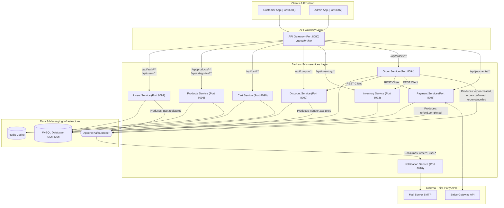
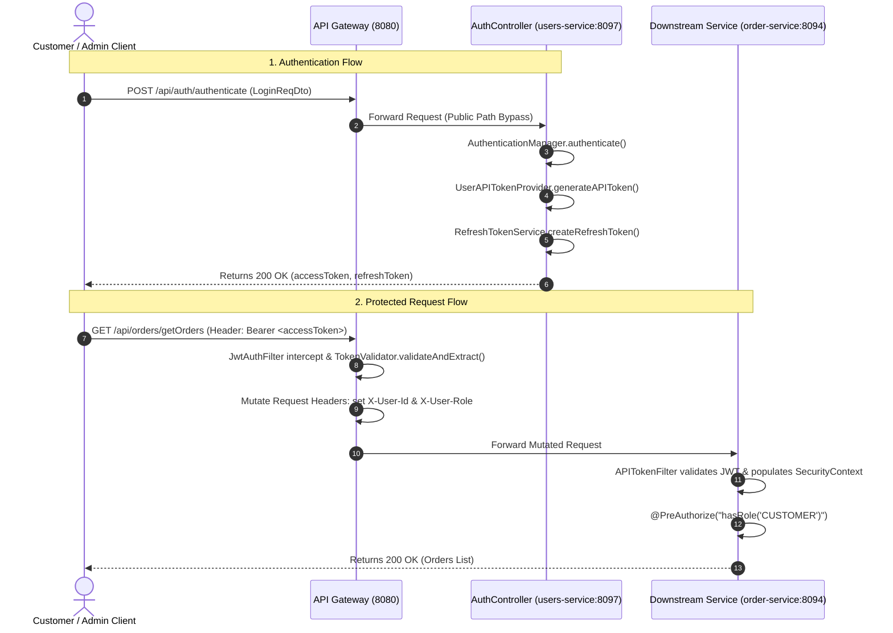
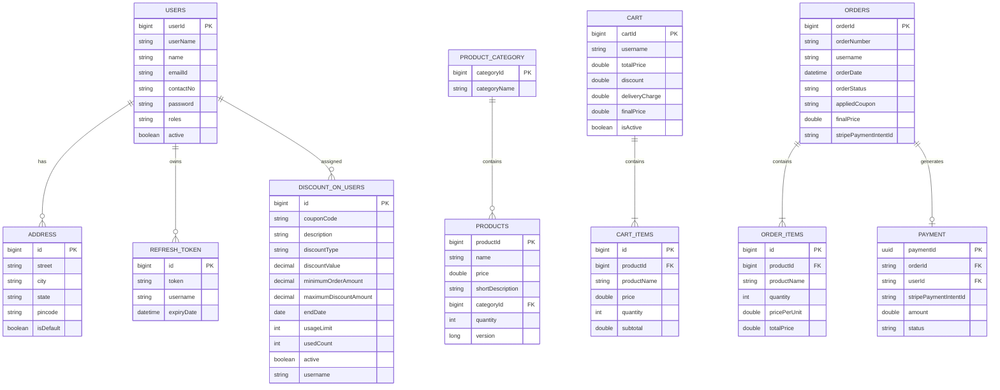
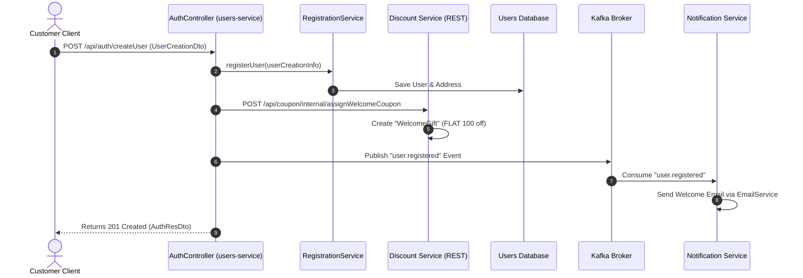
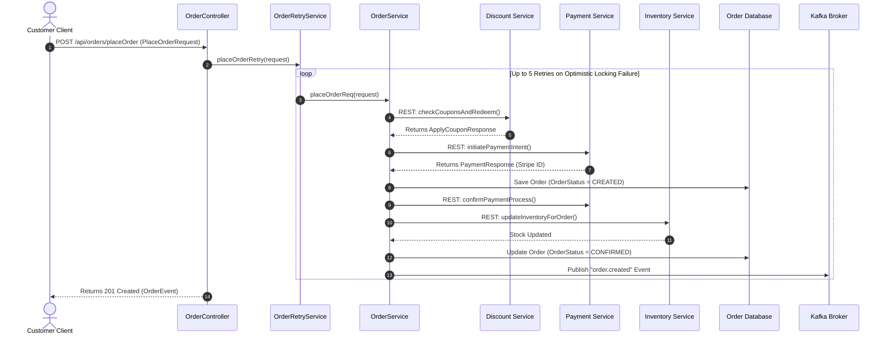
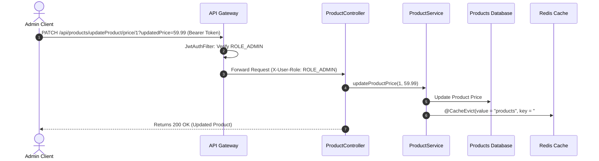

# E-Mart E-Commerce Microservices Platform — System Documentation

This document presents a comprehensive, factual, and interview-ready architectural analysis of the E-Mart Spring Boot microservices codebase.

---

## 1. PROJECT OVERVIEW

### 1.1 Business Purpose
E-Mart is an enterprise-grade e-commerce application platform built on a 'distributed microservices' architecture. It provides customer-facing shopping capabilities (user registration, catalog browsing, cart management, coupon redemption, checkout, order tracking) alongside administrator capabilities (product/category management, user administration, global order status updates, and coupon distribution).

### 1.2 Tech Stack
- **Java Version**: Java 17 (`<java.version>17</java.version>` in [pom.xml](file:///d:/Project/EcommerceApplication/pom.xml#L34))
- **Spring Boot Version**: Spring Boot 3.5.4 (`<version>3.5.4</version>` in [pom.xml](file:///d:/Project/EcommerceApplication/pom.xml#L12))
- **Spring Cloud**: Spring Cloud Gateway (Reactive WebFlux in `api-gateway`)
- **Database**: MySQL 8.0 (`jdbc:mysql://mysql:3306/...` in [.env](file:///d:/Project/EcommerceApplication/.env#L22))
- **Event Bus / Messaging**: Apache Kafka 4.2.0 (`SPRING_KAFKA_BOOTSTRAP_SERVERS` in [.env](file:///d:/Project/EcommerceApplication/.env#L17))
- **Caching**: Redis (`@Cacheable` in `products-service` and `cart-service`)
- **Payment Processing**: Stripe API (`stripe-java` 28.4.0 in `payment-service`)
- **Build Tool**: Apache Maven multi-module parent build ([pom.xml](file:///d:/Project/EcommerceApplication/pom.xml))
- **Frontend App**: Lightweight HTML5/CSS3/Vanilla JS testing suite (`frontend-app`)

### 1.3 Key Dependencies
The project uses standard Spring Boot starters and specialized dependencies declared across module POMs:
- `spring-boot-starter-web` & `spring-boot-starter-webflux`
- `spring-boot-starter-security`
- `jjwt-api`, `jjwt-impl`, `jjwt-jackson` (v0.12.6) for JSON Web Tokens
- `spring-boot-starter-data-jpa` & `mysql-connector-j`
- `spring-kafka` for event-driven messaging
- `spring-boot-starter-data-redis` for distributed caching
- `stripe-java` (v28.4.0) for credit card intent generation and webhook handling
- `spring-boot-starter-mail` for email notifications

---

## 2. ARCHITECTURE

### 2.1 High-Level Architecture Diagram
The architecture follows a reactive API Gateway pattern backed by 8 domain microservices, a MySQL database cluster, an Apache Kafka event broker, and external APIs (Stripe, SMTP).



### 2.2 Microservice Modules Responsibility Matrix

| Module Name | Port | Directory Path | Core Responsibility |
| :--- | :--- | :--- | :--- |
| **api-gateway** | 8080 | [api-gateway](file:///d:/Project/EcommerceApplication/api-gateway) | Central entry point, route routing (`application-dev.yml`), global JWT auth filter (`JwtAuthFilter.java`), header injection (`X-User-Id`, `X-User-Role`), CORS configuration (`CorsConfig.java`). |
| **users-service** | 8097 | [users-service](file:///d:/Project/EcommerceApplication/users-service) | Customer registration, authentication, JWT issuing (`UserAPITokenProvider.java`), refresh tokens (`RefreshTokenService.java`), user profiles and addresses (`UserController.java`). |
| **products-service** | 8096 | [products-service](file:///d:/Project/EcommerceApplication/products-service) | Product catalog management (`ProductController.java`), category management (`CategoryController.java`), product filtering/sorting, Redis catalog caching (`ProductService.java`). |
| **cart-service** | 8090 | [cart-service](file:///d:/Project/EcommerceApplication/cart-service) | Customer shopping cart state (`CartController.java`), item additions/updates/deletions, cart caching (`CartOperationsService.java`). |
| **discount-service** | 8092 | [discount-service](file:///d:/Project/EcommerceApplication/discount-service) | Welcome coupon issuance, discount rules calculation (`DiscountService.java`), coupon assignment (`DiscountController.java`). |
| **inventory-service** | 8093 | [inventory-service](file:///d:/Project/EcommerceApplication/inventory-service) | Stock tracking per product (`InventoryController.java`), inter-service stock reservation and optimistic quantity updates. |
| **order-service** | 8094 | [order-service](file:///d:/Project/EcommerceApplication/order-service) | Order placement workflow (`OrderController.java`), optimistic locking retry loop (`OrderRetryService.java`), inter-service REST orchestration, status transitions. |
| **payment-service** | 8095 | [payment-service](file:///d:/Project/EcommerceApplication/payment-service) | Stripe PaymentIntent generation (`PaymentController.java`), payment confirmation/refunds, Stripe webhook signature verification. |
| **notification-service** | 8098 | [notification-service](file:///d:/Project/EcommerceApplication/notification-service) | Async Kafka event listener (`KafkaConsumer.java`), customer email delivery via Spring Mail (`EmailService.java`). |

---

## 3. SECURITY ARCHITECTURE

### 3.1 Security Design & Dual-Tier Filter Model
The platform implements a **Dual-Tier Security Model**:
1. **Gateway Tier**: Public requests pass through [JwtAuthFilter.java](file:///d:/Project/EcommerceApplication/api-gateway/src/main/java/org/webapp/ecommerce/util/JwtAuthFilter.java#L19). Public paths (`/api/auth/authenticate`, `/api/auth/createUser`, `/api/auth/refreshAuth`, `/api/payments/webhook`) bypass authentication. For protected paths, the filter validates the `Authorization: Bearer <token>` header using [TokenValidator.java](file:///d:/Project/EcommerceApplication/api-gateway/src/main/java/org/webapp/ecommerce/util/TokenValidator.java), extracts the `username` and `role` claims, and forwards them as HTTP headers (`X-User-Id` and `X-User-Role`) to downstream services.
2. **Microservice Tier**: Each downstream service implements [ServiceSecurityConfig.java](file:///d:/Project/EcommerceApplication/users-service/src/main/java/org/webapp/ecommerce/util/ServiceSecurityConfig.java#L23) defining multiple ordered `SecurityFilterChain` beans:
   - `@Order(1)` `internalFilterChain`: Matches `/api/*/internal/**` or `/api/internal/**`. Intercepted by [ServiceTokenFilter.java](file:///d:/Project/EcommerceApplication/users-service/src/main/java/org/webapp/ecommerce/util/internalConfig/ServiceTokenFilter.java#L30) to enforce inter-service token validation (`ROLE_SERVICE`).
   - `@Order(2)` `apiFilterChain`: Matches standard user endpoints (`/api/**`). Intercepted by [APITokenFilter.java](file:///d:/Project/EcommerceApplication/users-service/src/main/java/org/webapp/ecommerce/util/apiConfig/APITokenFilter.java#L29) to validate user tokens and populate `SecurityContextHolder`.

### 3.2 Token Issuance, Validation, and Refresh Lifecycle
- **Token Generation**: Handled by [UserAPITokenProvider.java](file:///d:/Project/EcommerceApplication/users-service/src/main/java/org/webapp/ecommerce/util/apiConfig/UserAPITokenProvider.java#L33) using HMAC SHA-256 (`Jwts.SIG.HS256`).
- **Token Claims**: Contains `username`, `role` (`ROLE_CUSTOMER` or `ROLE_ADMIN`), `type="API"`, `svc="users-service"`, and `audience="external-api"`.
- **Refresh Token Strategy**: Stored in DB table `refresh_token` ([RefreshToken.java](file:///d:/Project/EcommerceApplication/users-service/src/main/java/org/webapp/ecommerce/auth/refreshtoken/entity/RefreshToken.java#L8)) managed by [RefreshTokenService.java](file:///d:/Project/EcommerceApplication/users-service/src/main/java/org/webapp/ecommerce/auth/refreshtoken/service/RefreshTokenService.java). Clients refresh tokens via `POST /api/auth/refreshAuth`.

### 3.3 Auth Sequence Diagram



### 3.4 CORS, CSRF, and Exception Handling
- **CORS Config**: Configured in [CorsConfig.java](file:///d:/Project/EcommerceApplication/api-gateway/src/main/java/org/webapp/ecommerce/kafka/CorsConfig.java#L13) at the Gateway layer. Allows origins `http://localhost:3000` and `"null"` (direct `file://` browser access).
- **CSRF**: Disabled (`csrf.disable()`) across all Spring Security configurations as the backend is stateless REST using Bearer tokens.
- **Exception Handling**: Global exception handling implemented in each microservice via `@RestControllerAdvice` (e.g., [GlobalExceptionHandler.java](file:///d:/Project/EcommerceApplication/users-service/src/main/java/org/webapp/ecommerce/exception/GlobalExceptionHandler.java#L19)) returning structured JSON error payloads.

---

## 4. API DOCUMENTATION

### 4.1 Auth & Users Domain (`users-service`)
- `POST /api/auth/authenticate`: Public. Request: `LoginReqDto` (`username`, `password`). Response: `AuthResDto` (`accessToken`, `refreshToken`).
- `POST /api/auth/createUser`: Public. Request: `UserCreationDto` (`userName`, `password`, `confirmPassword`, `emailId`, `contactNo`, `name`, `address`). Response: `AuthResDto`.
- `POST /api/auth/refreshAuth`: Public. Request: `RefreshTokenInput`. Response: `String` (new token).
- `POST /api/auth/deleteRefreshAuth`: Public. Request: `RefreshTokenInput`. Response: `200 OK`.
- `GET /api/users/getUser`: Protected (`hasAnyRole('CUSTOMER', 'ADMIN')`). Returns logged-in user profile details.
- `GET /api/users/getUsers`: Protected (`hasRole('ADMIN')`). Params: `page`, `size`. Returns paginated list of all users.
- `PATCH /api/users/password`: Protected (`hasAnyRole('CUSTOMER', 'ADMIN')`). Request: `ChangePasswordRequest`.
- `PATCH /api/users/contactNo`: Protected (`hasAnyRole('CUSTOMER', 'ADMIN')`). Request: `ChangeOtherDetailsReq`.
- `PATCH /api/users/address`: Protected (`hasAnyRole('CUSTOMER', 'ADMIN')`). Request: `AddAddressReq`.
- `PATCH /api/users/deleteUser`: Protected (`hasAnyRole('CUSTOMER', 'ADMIN')`). Deactivates user.
- `GET /api/users/internal/getAllUsernames`: Internal (`hasRole('ADMIN') or hasRole('SERVICE')`).
- `GET /api/users/internal/getUserDetails/{username}`: Internal (`hasRole('SERVICE')`).

### 4.2 Products & Category Domain (`products-service`)
- `GET /api/categories/getCategories`: Protected (`hasAnyRole('CUSTOMER', 'ADMIN')`). Returns all categories.
- `POST /api/categories/addCategory/{categoryName}`: Protected (`hasRole('ADMIN')`). Creates category.
- `PATCH /api/categories/updateCategoryName/{categoryId}`: Protected (`hasRole('ADMIN')`). Param: `categoryName`.
- `GET /api/products/listAllProducts`: Protected (`hasAnyRole('CUSTOMER', 'ADMIN')`). Params: `page`, `size`.
- `GET /api/products/listAllProductsForAdmin`: Protected (`hasAnyRole('CUSTOMER', 'ADMIN')`). Params: `page`, `size`.
- `GET /api/products/listProductByCategory/{categoryId}`: Protected (`hasAnyRole('CUSTOMER', 'ADMIN')`).
- `GET /api/products/getProduct/{productId}`: Protected (`hasAnyRole('CUSTOMER', 'ADMIN')`).
- `POST /api/products/addProducts`: Protected (`hasRole('ADMIN')`). Request: `List<ProductReqDto>`.
- `DELETE /api/products/deleteProduct/{productId}`: Protected (`hasRole('ADMIN')`).
- `PATCH /api/products/updateProduct/price/{productId}`: Protected (`hasRole('ADMIN')`). Param: `updatedPrice`.
- `PATCH /api/products/updateProduct/name/{productId}`: Protected (`hasRole('ADMIN')`). Param: `updatedName`.
- `PATCH /api/products/updateProduct/description/{productId}`: Protected (`hasRole('ADMIN')`). Param: `newDescription`.
- `PATCH /api/products/updateProduct/category/{productId}/{categoryId}`: Protected (`hasRole('ADMIN')`).
- `GET /api/products/filterProducts`: Protected (`hasAnyRole('CUSTOMER', 'ADMIN')`). Params: `minPrice`, `maxPrice`, `page`, `size`.
- `GET /api/products/sortByPrice/{asc}`: Protected (`hasAnyRole('CUSTOMER', 'ADMIN')`). Path: `asc` (boolean).
- `GET /api/products/sortByName/{asc}`: Protected (`hasAnyRole('CUSTOMER', 'ADMIN')`). Path: `asc` (boolean).
- `GET /api/products/getInStockProducts`: Protected (`hasAnyRole('CUSTOMER', 'ADMIN')`).
- `GET /api/products/findByMatchingName/{matchingCase}`: Protected (`hasAnyRole('CUSTOMER', 'ADMIN')`).

### 4.3 Cart Domain (`cart-service`)
- `GET /api/cart/getCart`: Protected (`hasRole('CUSTOMER')`). Returns user cart object.
- `POST /api/cart/addToCart`: Protected (`hasRole('CUSTOMER')`). Request: `AddToCartDto` (`productId`, `quantity`).
- `PATCH /api/cart/update`: Protected (`hasRole('CUSTOMER')`). Params: `productId`, `quantity`, `positive` (boolean).
- `DELETE /api/cart/delete/{productId}`: Protected (`hasRole('CUSTOMER')`). Removes cart item.
- `DELETE /api/cart/deleteAll`: Protected (`hasRole('CUSTOMER')`). Clears cart.

### 4.4 Discount & Coupon Domain (`discount-service`)
- `GET /api/coupon/displayCoupons`: Protected (`hasRole('CUSTOMER')`). Returns active coupons for customer.
- `GET /api/coupon/displayAllCoupons`: Protected (`hasRole('ADMIN')`). Returns all global coupons.
- `POST /api/coupon/addCoupons/{filterPrice}`: Protected (`hasRole('ADMIN')`). Request: `AddDiscountDto`.
- `POST /api/coupon/addCouponsToAllUsers`: Protected (`hasRole('ADMIN')`). Request: `AddDiscountDto`.

### 4.5 Inventory Domain (`inventory-service`)
- All endpoints in `InventoryController.java` (`/api/inventory/internal/**`) are Internal (`hasRole('SERVICE')`). Excluded from customer/admin frontends.

### 4.6 Order Domain (`order-service`)
- `POST /api/orders/placeOrder`: Protected (`hasRole('CUSTOMER')`). Request: `PlaceOrderRequest` (`couponCode`, `items`).
- `GET /api/orders/getOrders`: Protected (`hasRole('CUSTOMER')`). Returns user orders.
- `GET /api/orders/getOrder/{orderNumber}`: Protected (`hasRole('CUSTOMER')`). Returns single order.
- `GET /api/orders/getAllOrders`: Protected (`hasRole('ADMIN')`). Returns system-wide orders.
- `PATCH /api/orders/cancelOrder/{orderNumber}`: Protected (`hasRole('CUSTOMER')`).
- `PATCH /api/orders/updateOrder/pending/{orderNumber}`: Protected (`hasRole('ADMIN')`).
- `PATCH /api/orders/updateOrder/confirmed/{orderNumber}`: Protected (`hasRole('ADMIN')`).
- `PATCH /api/orders/updateOrder/processing/{orderNumber}`: Protected (`hasRole('ADMIN')`).
- `PATCH /api/orders/updateOrder/shipped/{orderNumber}`: Protected (`hasRole('ADMIN')`).
- `PATCH /api/orders/updateOrder/outForDelivery/{orderNumber}`: Protected (`hasRole('ADMIN')`).
- `PATCH /api/orders/updateOrder/delivered/{orderNumber}`: Protected (`hasRole('ADMIN')`).

### 4.7 Payment Domain (`payment-service`)
- `GET /api/payments/{paymentId}`: Protected (JWT required).
- `GET /api/payments/order/{orderId}`: Protected (JWT required).
- `GET /api/payments/user/{userId}`: Protected (JWT required).
- `POST /api/payments/webhook`: Public (Stripe Signature verified).

---

## 5. DATA MODEL

### 5.1 Entity Overview
- **Users** ([Users.java](file:///d:/Project/EcommerceApplication/users-service/src/main/java/org/webapp/ecommerce/entity/Users.java#L15)): `userId`, `userName`, `name`, `emailId`, `contactNo`, `password`, `roles`, `active`, `createdAt`.
- **Address** ([Address.java](file:///d:/Project/EcommerceApplication/users-service/src/main/java/org/webapp/ecommerce/entity/Address.java#L8)): `id`, `street`, `city`, `state`, `pincode`, `isDefault`.
- **Products** ([Products.java](file:///d:/Project/EcommerceApplication/products-service/src/main/java/org/webapp/ecommerce/entity/Products.java#L7)): `productId`, `name`, `price`, `shortDescription`, `categoryId`, `quantity`, `@Version version`.
- **ProductCategory** ([ProductCategory.java](file:///d:/Project/EcommerceApplication/products-service/src/main/java/org/webapp/ecommerce/entity/ProductCategory.java#L10)): `categoryId`, `categoryName`.
- **Cart** ([Cart.java](file:///d:/Project/EcommerceApplication/cart-service/src/main/java/org/webapp/ecommerce/entity/Cart.java#L9)): `cartId`, `username`, `totalPrice`, `discount`, `deliveryCharge`, `finalPrice`, `isActive`.
- **CartItems** ([CartItems.java](file:///d:/Project/EcommerceApplication/cart-service/src/main/java/org/webapp/ecommerce/entity/CartItems.java#L6)): `id`, `productId`, `productName`, `price`, `quantity`, `subtotal`.
- **Orders** ([Orders.java](file:///d:/Project/EcommerceApplication/order-service/src/main/java/org/webapp/ecommerce/entity/Orders.java#L8)): `orderId`, `orderNumber`, `username`, `orderDate`, `orderStatus`, `appliedCoupon`, `finalPrice`, `stripePaymentIntentId`.
- **OrderItems** ([OrderItems.java](file:///d:/Project/EcommerceApplication/order-service/src/main/java/org/webapp/ecommerce/entity/OrderItems.java#L7)): `id`, `productId`, `productName`, `quantity`, `pricePerUnit`, `totalPrice`.
- **Payment** ([Payment.java](file:///d:/Project/EcommerceApplication/payment-service/src/main/java/org/webapp/ecommerce/entity/Payment.java#L12)): `paymentId`, `orderId`, `userId`, `stripePaymentIntentId`, `amount`, `status`, `createdAt`.
- **DiscountOnUsers** ([DiscountOnUsers.java](file:///d:/Project/EcommerceApplication/discount-service/src/main/java/org/webapp/ecommerce/entity/DiscountOnUsers.java#L7)): `id`, `couponCode`, `description`, `discountType`, `discountValue`, `minimumOrderAmount`, `maximumDiscountAmount`, `startDate`, `endDate`, `usageLimit`, `usedCount`, `active`, `username`.

### 5.2 Mermaid ER Diagram



---

## 6. REQUEST WORKFLOWS

### 6.1 Flow 1: User Registration & Welcome Coupon Assignment



### 6.2 Flow 2: Order Checkout & Optimistic Locking Retry Flow



### 6.3 Flow 3: Admin Product Update & Cache Eviction



---

## 7. CONFIGURATION & DEPLOYMENT

### 7.1 Key Configuration Files & Profiles
- **Gateway Configuration**: Configured in [application-dev.yml](file:///d:/Project/EcommerceApplication/api-gateway/src/main/resources/application-dev.yml). Maps routes `/api/cart/**`, `/api/coupon/**`, `/api/inventory/**`, `/api/orders/**`, `/api/categories/**`, `/api/products/**`, `/api/users/**`, `/api/auth/**`, `/api/payments/**`.
- **Environment Variables**: [.env](file:///d:/Project/EcommerceApplication/.env) specifies service ports:
  - `API_GATEWAY_PORT=8080`
  - `CART_SERVICE_PORT=8090`
  - `DISCOUNT_SERVICE_PORT=8092`
  - `INVENTORY_SERVICE_PORT=8093`
  - `ORDER_SERVICE_PORT=8094`
  - `PAYMENT_SERVICE_PORT=8095`
  - `PRODUCTS_SERVICE_PORT=8096`
  - `USERS_SERVICE_PORT=8097`
  - `NOTIFICATION_SERVICE_PORT=8098`

### 7.2 Containerized Docker Deployment
The system is fully containerized using Docker Compose ([docker-compose.yml](file:///d:/Project/EcommerceApplication/docker-compose.yml)).

**Building & Running Commands**:
```bash
# Build and launch all microservices, databases, Kafka, and frontends in background
docker-compose up --build -d

# View status of running containers
docker-compose ps

# Stop all container services
docker-compose down
```

**Deployed Container Suite**:
1. `ecommerce-mysql` (Port `4306:3306`)
2. `kafka` (Port `9092`)
3. `api-gateway` (Port `8080`)
4. `users-service` (Port `8097`)
5. `products-service` (Port `8096`)
6. `cart-service` (Port `8090`)
7. `discount-service` (Port `8092`)
8. `inventory-service` (Port `8093`)
9. `order-service` (Port `8094`)
10. `payment-service` (Port `8095`)
11. `notification-service` (Port `8098`)
12. `frontend-customer` (Port `3001:80`)
13. `frontend-admin` (Port `3002:80`)

---

## 8. KEY DESIGN DECISIONS

| Design Decision / Pattern | Implementation Location | Rationale |
| :--- | :--- | :--- |
| **Dual-Tier Security Filter Model** | [ServiceSecurityConfig.java](file:///d:/Project/EcommerceApplication/users-service/src/main/java/org/webapp/ecommerce/util/ServiceSecurityConfig.java#L46) | Separates public/user API JWT authentication from inter-service REST call authentication (`ROLE_SERVICE`). |
| **Gateway Header Mutation** | [JwtAuthFilter.java](file:///d:/Project/EcommerceApplication/api-gateway/src/main/java/org/webapp/ecommerce/util/JwtAuthFilter.java#L71) | Decouples Gateway auth verification from downstream services by attaching `X-User-Id` and `X-User-Role` headers. |
| **Optimistic Lock Retry Pattern** | [OrderRetryService.java](file:///d:/Project/EcommerceApplication/order-service/src/main/java/org/webapp/ecommerce/service/OrderRetryService.java#L28) | Uses loop retries with backoff to recover gracefully from concurrent inventory JPA `@Version` updates. |
| **Asynchronous Event-Driven Messaging** | [KafkaConsumer.java](file:///d:/Project/EcommerceApplication/notification-service/src/main/java/org/webapp/ecommerce/kafka/KafkaConsumer.java#L32) | Decouples email notification processing from checkout API execution for zero-latency response times. |
| **Distributed Caching Strategy** | [CartOperationsService.java](file:///d:/Project/EcommerceApplication/cart-service/src/main/java/org/webapp/ecommerce/service/CartOperationsService.java#L232) | Utilizes Redis `@Cacheable` and `@CacheEvict` to optimize high-frequency shopping cart and product reads. |
| **Centralized Controller Exception Advice** | [GlobalExceptionHandler.java](file:///d:/Project/EcommerceApplication/users-service/src/main/java/org/webapp/ecommerce/exception/GlobalExceptionHandler.java#L19) | Converts uncaught business exceptions into consistent, structured HTTP error JSON responses. |
| **Third-Party Payment Webhook Receiver** | [PaymentController.java](file:///d:/Project/EcommerceApplication/payment-service/src/main/java/org/webapp/ecommerce/controller/PaymentController.java#L90) | Provides an unauthenticated, Stripe-Signature-verified callback endpoint for automated asynchronous payment webhooks. |
